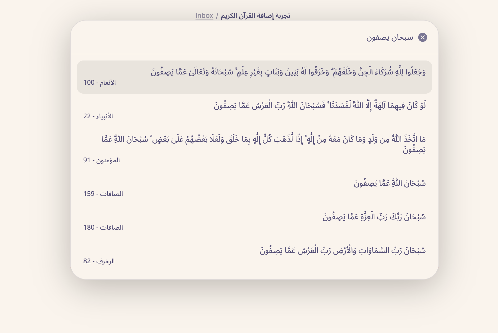

# إضافة Quran Helper

إضافة لـ Obsidian يساعدك على العثور على إدراج آيات القرآن في ملاحظاتك.

| البحث بمطابقة جزئية (Fuzzy find)                       | الآيات المعروضة                                          |
| ------------------------------------------------------ | -------------------------------------------------------- |
|  |  |

## الميزات

- إضافة الآيات مباشرةً في ملاحظاتك.
- البحث بمطابقة جزئية عن الآيات.
- لا يتطلب اتصالاً بالإنترنت.

## التثبيت

يمكن تثبيت الإضافة مباشرةً من [community plugins](https://obsidian.md/plugins?id=quran-helper).

1. افتح إعدادات Obsidian
2. انتقل إلى `Community plugins`
3. ابحث عن `Quran Helper`
4. انقر على `Install` ثم `Enable`

## الاستخدام

- افتح نافذة القرآن عن طريق النقر على أيقونة الكتاب في الشريط الجانبي ([Ribbon](https://help.obsidian.md/ribbon))
  - أو عن طريق اختيار الأمر `Quran: Add Ayah` من [Command Palette](https://help.obsidian.md/Plugins/Command+palette)
- ابحث عن الآية المطلوبة (يمكنك كتابة حروف أو كلمات جزئية للعثور على الآية التي تبحث عنها)
- اضغط <kbd>Enter</kbd> لإدراج الآية في ملاحظتك

## الاختلاف عن إضافة [Obsidian Quran Lookup Plugin](https://github.com/abuibrahim2/quranlookup)

- هذه الإضافة لا تتطلب تنسيق `Surah:Ayah`
- هذه الإضافة لا يتطلب اتصالاً بالإنترنت
- يمكنك البحث بمطابقة جزئية في محتوى الآيات

## مصادر

الإضافة تستخدم [quran-json](https://github.com/risan/quran-json).
