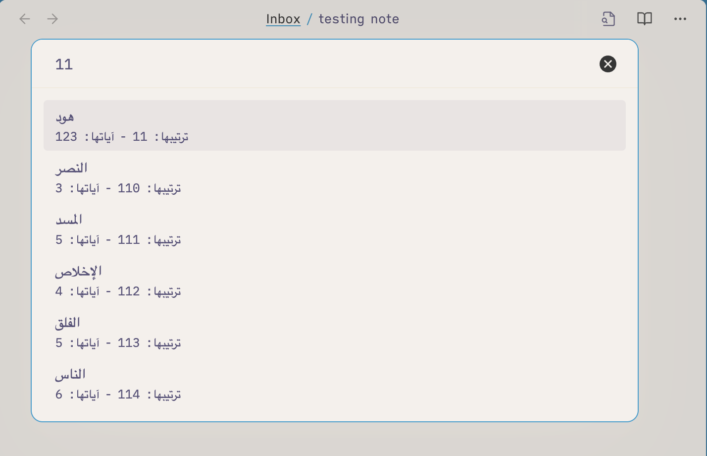
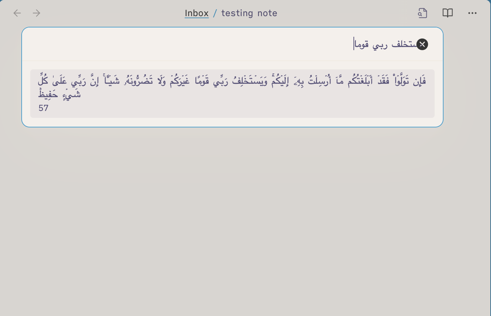
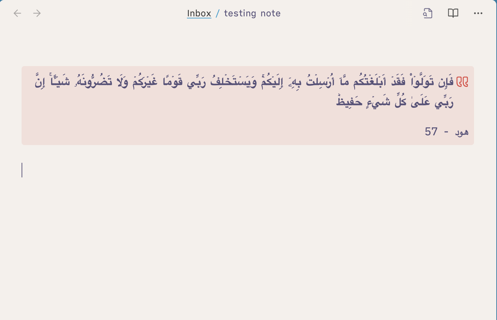
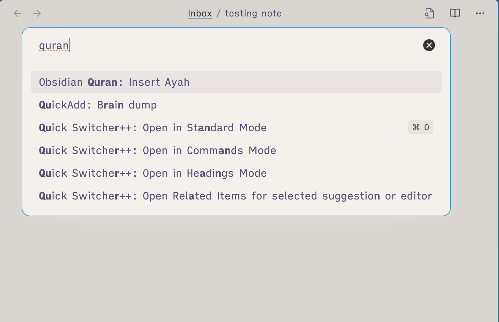
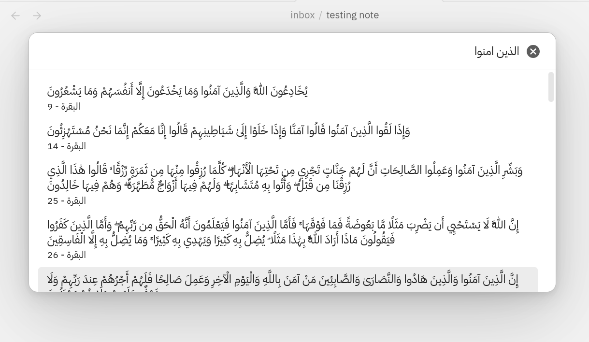

# Quran Helper Plugin

An Obsidian plugin that helps you select and insert Ayahs (verses) from the Quran into your Obsidian notes. Inserted Ayahs are added to a [quote callout](https://help.obsidian.md/Editing+and+formatting/Callouts) by default.

| Selecting Ayah                                    | Rendered Ayah                                            | Command Palette                                                | Fuzzy Search (fzf)                                        |
| ------------------------------------------------- | -------------------------------------------------------- | -------------------------------------------------------------- | -------------------------------------------------------- |
|  |  |  |       |

## Features

-   Insert Ayahs directly into your notes.
-   Fuzzy search for Surah names or Ayah content.
-   No internet connection required.

## Installation

1. Open the Obsidian settings.
2. Navigate to `Community plugins`.
3. Search for `Quran Helper`.
4. Click `Install` and then `Enable`.

## Usage

-   Open the Quran modal by clicking the book icon in the ribbon or selecting the `Insert Ayah` command from the [Command Palette](https://help.obsidian.md/Plugins/Command+palette).
-   In the modal, choose the Surah by name or number.
-   Browse or fuzzy search for the desired Ayah.

## Tip on Searching

When searching for a Surah or an Ayah (verse), you can type part of the number or content of that Surah or Ayah, it doesn't have to be from the beginning.

For example:

-   Type `11` when searching for Surah Al-Nas (numbered 114).
-   Type a few characters from the Surah name (e.g., `النا`) to filter the list.

## Comparison with [Obsidian Quran Lookup Plugin](https://github.com/abuibrahim2/quranlookup)

This plugin differs from the Quran Lookup plugin in several ways:

-   Does not require `Surah:Ayah` format.
-   Does not require an internet connection.
-   Allows for fuzzy searching of Surah names or Ayah content.

## Credits

The plugin uses the [quran-json](https://github.com/risan/quran-json).
