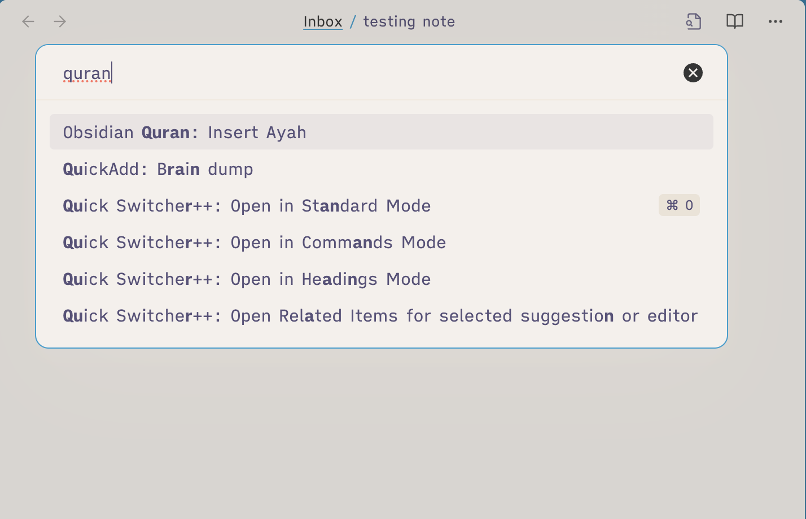
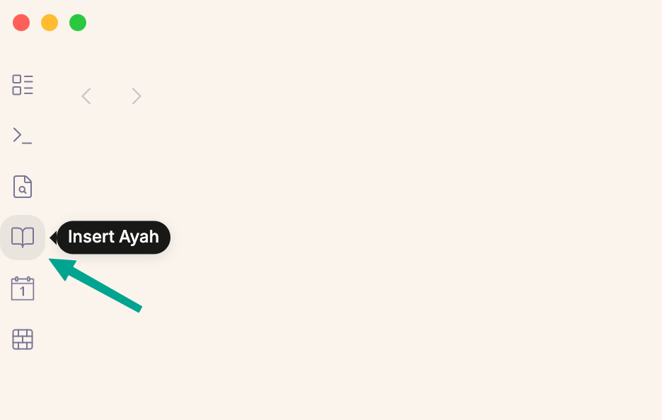
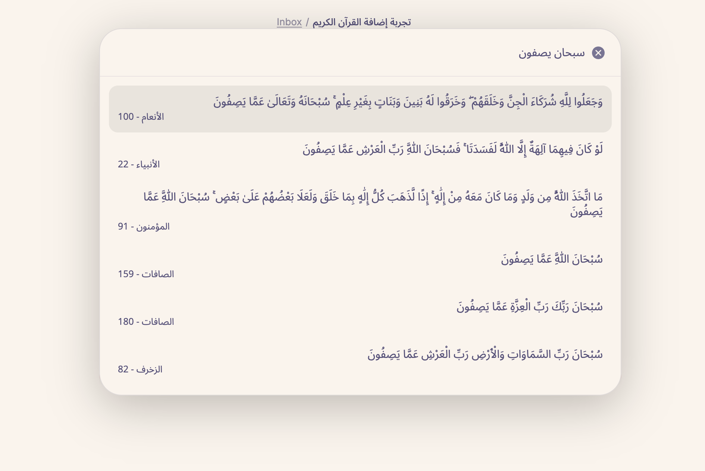
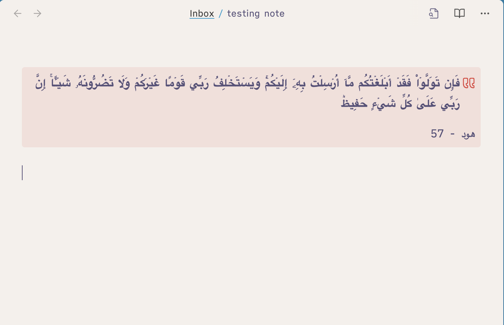

# إضافة Quran Helper

إضافة لـ Obsidian يساعدك على العثور على إدراج آيات القرآن في ملاحظاتك.

## Quran Helper (English)

A plugin for Obsidian that helps you search and insert Quran ayahs and surahs into your notes. Supports fuzzy search by ayah text, surah name, or numeric reference, with multiple output formats.

### Features

- Fuzzy search for ayahs by Arabic text, surah name, or reference number
- Insert ayahs as blockquote, callout, or inline text
- Search and insert full surahs
- Search and insert by page number (1—604)
- Create ayah notes linked to your vault
- Customizable output format and callout type
- Offline-first, works without internet

### Installation

1. Open Obsidian Settings
2. Go to Community Plugins → Browse
3. Search for "Quran Helper"
4. Click Install then Enable

### Usage

- **Insert Ayah** — Search and insert a specific ayah
- **Insert Surah** — Search and insert a full surah
- **Insert Page** — Search and insert by page number
- **Create Ayah Note** — Create a standalone note for an ayah
- Press `Mod+Enter` (Cmd/Ctrl) to insert inline without changing your default format

## لقطات الشاشة

### 1) بدء الإدراج

| من Command Palette                                                            | من Ribbon                                                   |
| ----------------------------------------------------------------------------- | ----------------------------------------------------------- |
|  |  |

### 2) البحث عن الآية

### 3) شكل الناتج بعد الإدراج

### 4) الإدراج المدمج (Inline)

يمكنك إدراج الآية كنص مدمج داخل الفقرة بدلاً من كتلة منفصلة:

استخدم `Mod+Enter` (Cmd على Mac / Ctrl على Windows) عند اختيار الآية لإدراجها بهذا الشكل.

### 5) نمط إضافة لقطات الميزات الجديدة

لتحسين تجربة القراءة مع زيادة عدد الصور، أضف كل ميزة جديدة بنفس التسلسل:

1. **بدء الميزة** (الأمر أو الأيقونة)
2. **البحث/الاختيار** داخل النافذة
3. **النتيجة النهائية** داخل الملاحظة

يفضل أن تكون أسماء الملفات وصفية وثابتة، مثل:

- `surah-start-command-palette.png`
- `surah-search.png`
- `surah-rendered.png`

## الميزات

- إدراج آية محددة في الملاحظة عبر `Insert Ayah (إدراج آية)`
- إدراج سورة كاملة عبر `Insert Surah (إدراج سورة)`
- إدراج صفحة من المصحف (1-604) كاملة أو اختيار آية منها عبر `Insert Page (إدراج صفحة)`
- إنشاء ملاحظة مستقلة لآية محددة عبر `Create Ayah Note (إنشاء ملاحظة آية)`
- ثلاث صيغ إدراج: Callout، Blockquote، ومدمج (Inline)
- إدراج مدمج سريع عبر `Mod+Enter` (Cmd/Ctrl) دون تغيير الإعدادات
- بحث سريع بمطابقة جزئية (Fuzzy) يدعم التطبيع العربي والبحث بالأرقام (رقم السورة/الآية/الصفحة)
- يعمل بالكامل دون اتصال بالإنترنت

## الإعدادات

من إعدادات الإضافة يمكنك التحكم في:

- **صيغة الإدراج**: `Callout` أو `Blockquote` أو `Inline` (المدمج)
- **نوع الـ Callout**: مثل `quran-ayah` أو أي نوع آخر مدعوم في Obsidian
- **إعدادات ملاحظة الآية**:
  - مجلد حفظ الملاحظة
  - نمط اسم/مسار الملف:
    - `surah-ayah` (مثل `Al-Mulk-1`)
    - `surah/ayah` (مثل `Al-Mulk/1`)
    - `arabic-ayah` (مثل `الملك-1`)
    - `arabic/ayah` (مثل `الملك/1`)
  - وسوم تلقائية (Tags) للملاحظات الجديدة

## التثبيت

يمكن تثبيت الإضافة مباشرةً من [community plugins](https://obsidian.md/plugins?id=quran-helper).

1. افتح إعدادات Obsidian
2. انتقل إلى `Community plugins`
3. ابحث عن `Quran Helper`
4. انقر على `Install` ثم `Enable`

## الاستخدام

- افتح [Command Palette](https://help.obsidian.md/Plugins/Command+palette) ثم اختر أحد الأوامر:
  - `Insert Ayah (إدراج آية)`
  - `Insert Surah (إدراج سورة)`
  - `Insert Page (إدراج صفحة)`
  - `Create Ayah Note (إنشاء ملاحظة آية)`
- أو استخدم أيقونات الشريط الجانبي ([Ribbon](https://help.obsidian.md/ribbon)) المقابلة لكل عملية
- **إدراج مدمج سريع**: عند ظهور نافذة البحث، اضغط `Mod+Enter` (Cmd على Mac / Ctrl على Windows) لإدراج النص بشكل مدمج `{ الآية } – السورة الرقم` بغض النظر عن الإعداد الافتراضي
- في إدراج الصفحة: اختر الصفحة أولاً ثم حدّد إدراج الصفحة كاملة أو آية واحدة منها
- في إنشاء ملاحظة آية: اختر الآية وسيتم إنشاء ملف جديد حسب إعداداتك

## الاختلاف عن إضافة [Obsidian Quran Lookup Plugin](https://github.com/abuibrahim2/quranlookup)

- هذه الإضافة لا تتطلب تنسيق `Surah:Ayah`
- تدعم إدراج السورة كاملة وإدراج الصفحة مع اختيار آيات منها
- تدعم إنشاء ملاحظات آيات تلقائياً مع أنماط أسماء ووسوم قابلة للتخصيص
- لا يتطلب اتصالاً بالإنترنت
- يمكن البحث بمطابقة جزئية في محتوى الآيات

## مصادر

الإضافة تستخدم [QPC Hafs script](https://qul.tarteel.ai/resources/quran-script/86) by QUL / TarteelAL
