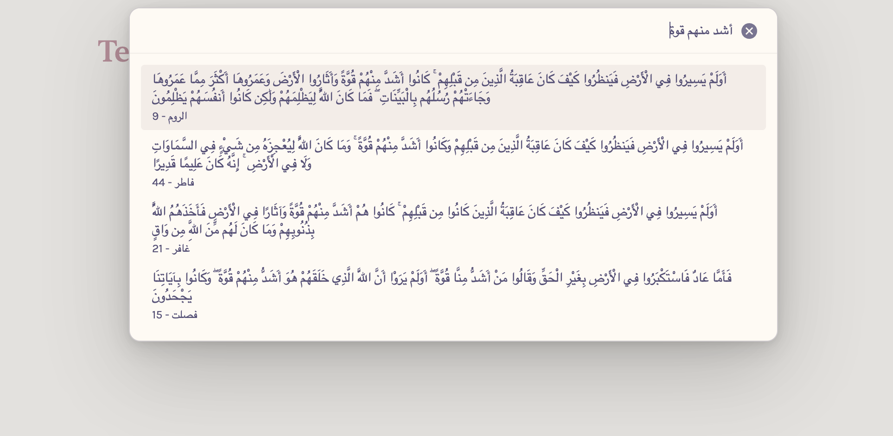

# إضافة Quran Helper

إضافة لـ Obsidian يساعدك على العثور على إدراج آيات القرآن في ملاحظاتك.

## لقطات الشاشة

### 1) بدء الإدراج

| من Command Palette                                                            | من Ribbon                                                   |
| ----------------------------------------------------------------------------- | ----------------------------------------------------------- |
|  |  |

### 2) البحث عن الآية

### 3) شكل الناتج بعد الإدراج

### 4) نمط إضافة لقطات الميزات الجديدة

لتحسين تجربة القراءة مع زيادة عدد الصور، أضف كل ميزة جديدة بنفس التسلسل:

1. **بدء الميزة** (الأمر أو الأيقونة)
2. **البحث/الاختيار** داخل النافذة
3. **النتيجة النهائية** داخل الملاحظة

يفضل أن تكون أسماء الملفات وصفية وثابتة، مثل:

- `surah-start-command-palette.png`
- `surah-search.png`
- `surah-rendered.png`

## الميزات

- إدراج آية محددة في الملاحظة عبر `Insert Ayah (إدراج آية)`
- إدراج سورة كاملة عبر `Insert Surah (إدراج سورة)`
- إدراج صفحة من المصحف (1-604) كاملة أو اختيار آية منها عبر `Insert Page (إدراج صفحة)`
- إنشاء ملاحظة مستقلة لآية محددة عبر `Create Ayah Note (إنشاء ملاحظة آية)`
- بحث سريع بمطابقة جزئية (Fuzzy) يدعم التطبيع العربي والبحث بالأرقام (رقم السورة/الآية/الصفحة)
- يعمل بالكامل دون اتصال بالإنترنت

## الإعدادات

من إعدادات الإضافة يمكنك التحكم في:

- **صيغة الإدراج**: `Blockquote` أو `Callout`
- **نوع الـ Callout**: مثل `quran-ayah` أو أي نوع آخر مدعوم في Obsidian
- **إعدادات ملاحظة الآية**:
  - مجلد حفظ الملاحظة
  - نمط اسم/مسار الملف:
    - `surah-ayah` (مثل `Al-Mulk-1`)
    - `surah/ayah` (مثل `Al-Mulk/1`)
    - `arabic-ayah` (مثل `الملك-1`)
    - `arabic/ayah` (مثل `الملك/1`)
  - وسوم تلقائية (Tags) للملاحظات الجديدة

## التثبيت

يمكن تثبيت الإضافة مباشرةً من [community plugins](https://obsidian.md/plugins?id=quran-helper).

1. افتح إعدادات Obsidian
2. انتقل إلى `Community plugins`
3. ابحث عن `Quran Helper`
4. انقر على `Install` ثم `Enable`

## الاستخدام

- افتح [Command Palette](https://help.obsidian.md/Plugins/Command+palette) ثم اختر أحد الأوامر:
  - `Insert Ayah (إدراج آية)`
  - `Insert Surah (إدراج سورة)`
  - `Insert Page (إدراج صفحة)`
  - `Create Ayah Note (إنشاء ملاحظة آية)`
- أو استخدم أيقونات الشريط الجانبي ([Ribbon](https://help.obsidian.md/ribbon)) المقابلة لكل عملية
- في إدراج الصفحة: اختر الصفحة أولاً ثم حدّد إدراج الصفحة كاملة أو آية واحدة منها
- في إنشاء ملاحظة آية: اختر الآية وسيتم إنشاء ملف جديد حسب إعداداتك

## الاختلاف عن إضافة [Obsidian Quran Lookup Plugin](https://github.com/abuibrahim2/quranlookup)

- هذه الإضافة لا تتطلب تنسيق `Surah:Ayah`
- تدعم إدراج السورة كاملة وإدراج الصفحة مع اختيار آيات منها
- تدعم إنشاء ملاحظات آيات تلقائياً مع أنماط أسماء ووسوم قابلة للتخصيص
- لا يتطلب اتصالاً بالإنترنت
- يمكن البحث بمطابقة جزئية في محتوى الآيات

## مصادر

الإضافة تستخدم [QPC Hafs script](https://qul.tarteel.ai/resources/quran-script/86) by QUL / TarteelAL
