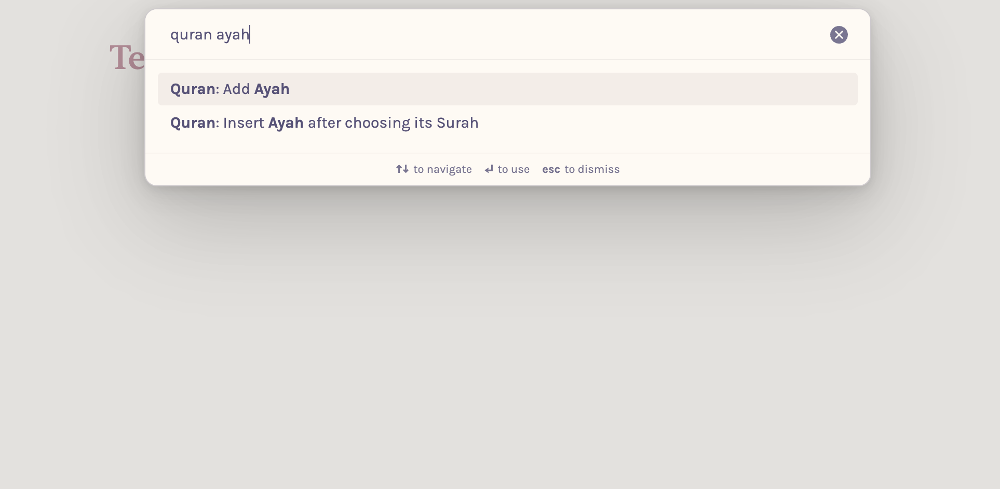

# Obsidian Quran Plugin

A simple plugin to help you select and insert Ayahs (verses) from the Quran into your Obsidian notes. Inserted Ayahs are added to a [quote callout](https://help.obsidian.md/Editing+and+formatting/Callouts) by default.


| Selecting Ayah                                    | Rendered Ayah                                            | Command Palette                                                |
| ------------------------------------------------- | -------------------------------------------------------- | -------------------------------------------------------------- |
|  |  |  |

## Features

-   Insert Ayahs directly into your notes.
-   Fuzzy search for Surah names or Ayah content.
-   No internet connection required.

## Installation

1. Open the Obsidian settings.
2. Navigate to `Community plugins`.
3. Search for `Quran Plugin`.
4. Click `Install` and then `Enable`.

## Usage

-   Open the Quran modal by clicking the book icon in the ribbon or selecting the `Insert Ayah` command from the [Command Palette](https://help.obsidian.md/Plugins/Command+palette).
-   In the modal, choose the Surah by name or number.
-   Browse or fuzzy search for the desired Ayah.

## Tip on Fuzzy Searching

When searching for a Surah or an Ayah (verse), you can type part of the number or content of that Surah or Ayah.

For example:

-   Type `11` when searching for Surah Al-Nas (numbered 114).
-   Type a few characters from the Surah name (e.g., `النا`) to filter the list.

## Comparison with [Obsidian Quran Lookup Plugin](https://github.com/abuibrahim2/quranlookup)

This plugin differs from the Quran Lookup plugin in several ways:

-   Does not require `Surah:Ayah` format.
-   Does not require an internet connection.
-   Allows for fuzzy searching of Surah names or Ayah content.

---

This is a sample plugin for Obsidian (https://obsidian.md).

This project uses Typescript to provide type checking and documentation.
The repo depends on the latest plugin API (obsidian.d.ts) in Typescript Definition format, which contains TSDoc comments describing what it does.

**Note:** The Obsidian API is still in early alpha and is subject to change at any time!

This sample plugin demonstrates some of the basic functionality the plugin API can do.

-   Adds a ribbon icon, which shows a Notice when clicked.
-   Adds a command "Open Sample Modal" which opens a Modal.
-   Adds a plugin setting tab to the settings page.
-   Registers a global click event and output 'click' to the console.
-   Registers a global interval which logs 'setInterval' to the console.

## First time developing plugins?

Quick starting guide for new plugin devs:

-   Check if [someone already developed a plugin for what you want](https://obsidian.md/plugins)! There might be an existing plugin similar enough that you can partner up with.
-   Make a copy of this repo as a template with the "Use this template" button (login to GitHub if you don't see it).
-   Clone your repo to a local development folder. For convenience, you can place this folder in your `.obsidian/plugins/your-plugin-name` folder.
-   Install NodeJS, then run `npm i` in the command line under your repo folder.
-   Run `npm run dev` to compile your plugin from `main.ts` to `main.js`.
-   Make changes to `main.ts` (or create new `.ts` files). Those changes should be automatically compiled into `main.js`.
-   Reload Obsidian to load the new version of your plugin.
-   Enable plugin in settings window.
-   For updates to the Obsidian API run `npm update` in the command line under your repo folder.

## Releasing new releases

-   Update your `manifest.json` with your new version number, such as `1.0.1`, and the minimum Obsidian version required for your latest release.
-   Update your `versions.json` file with `"new-plugin-version": "minimum-obsidian-version"` so older versions of Obsidian can download an older version of your plugin that's compatible.
-   Create new GitHub release using your new version number as the "Tag version". Use the exact version number, don't include a prefix `v`. See here for an example: https://github.com/obsidianmd/obsidian-sample-plugin/releases
-   Upload the files `manifest.json`, `main.js`, `styles.css` as binary attachments. Note: The manifest.json file must be in two places, first the root path of your repository and also in the release.
-   Publish the release.

> You can simplify the version bump process by running `npm version patch`, `npm version minor` or `npm version major` after updating `minAppVersion` manually in `manifest.json`.
> The command will bump version in `manifest.json` and `package.json`, and add the entry for the new version to `versions.json`

## Adding your plugin to the community plugin list

-   Check https://github.com/obsidianmd/obsidian-releases/blob/master/plugin-review.md
-   Publish an initial version.
-   Make sure you have a `README.md` file in the root of your repo.
-   Make a pull request at https://github.com/obsidianmd/obsidian-releases to add your plugin.

## How to use

-   Clone this repo.
-   Make sure your NodeJS is at least v16 (`node --version`).
-   `npm i` or `yarn` to install dependencies.
-   `npm run dev` to start compilation in watch mode.

## Manually installing the plugin

-   Copy over `main.js`, `styles.css`, `manifest.json` to your vault `VaultFolder/.obsidian/plugins/your-plugin-id/`.

## Improve code quality with eslint (optional)

-   [ESLint](https://eslint.org/) is a tool that analyzes your code to quickly find problems. You can run ESLint against your plugin to find common bugs and ways to improve your code.
-   To use eslint with this project, make sure to install eslint from terminal:
    -   `npm install -g eslint`
-   To use eslint to analyze this project use this command:
    -   `eslint main.ts`
    -   eslint will then create a report with suggestions for code improvement by file and line number.
-   If your source code is in a folder, such as `src`, you can use eslint with this command to analyze all files in that folder:
    -   `eslint .\src\`

## Funding URL

You can include funding URLs where people who use your plugin can financially support it.

The simple way is to set the `fundingUrl` field to your link in your `manifest.json` file:

```json
{
	"fundingUrl": "https://buymeacoffee.com"
}
```

If you have multiple URLs, you can also do:

```json
{
	"fundingUrl": {
		"Buy Me a Coffee": "https://buymeacoffee.com",
		"GitHub Sponsor": "https://github.com/sponsors",
		"Patreon": "https://www.patreon.com/"
	}
}
```

## API Documentation

See https://github.com/obsidianmd/obsidian-api
